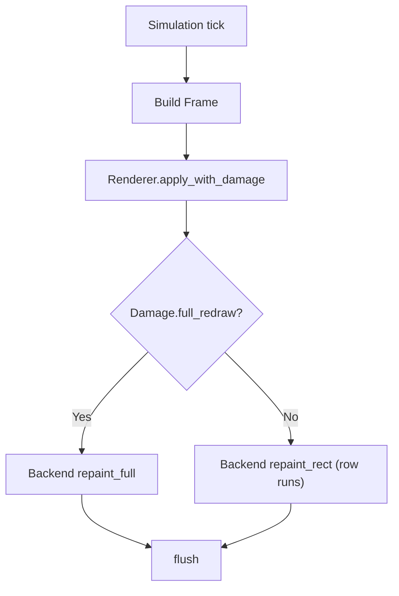

# Animation Cookbook

This cookbook focuses on building low-flicker, high-frequency terminal animations using `termgrid-core` plus an ANSI backend (e.g., `ansi-host`). The target workload is “BBS door game” style ASCII/ANSI animation where frame cadence matters and full-screen redraws cause flicker.

termgrid-core provides two key primitives for animation backends:

- A deterministic `Renderer` that mutates an in-memory grid.
- Conservative damage reporting via `Renderer::apply_with_damage()`.

The backend’s job is to efficiently translate (grid, damage) into escape sequences with minimal terminal I/O.

---

## 1. Baseline Animation Loop

A typical game loop produces a `Frame` each tick.

```rust
use termgrid_core::{Renderer, GlyphRegistry};

fn tick(renderer: &mut Renderer, reg: &GlyphRegistry, backend: &mut impl Backend, frame: &Frame) {
    // Apply frame and compute damage
    let dmg = renderer.apply_with_damage(frame);

    // Repaint only what changed
    if dmg.full_redraw {
        backend.repaint_full(renderer.grid(), reg);
    } else {
        for r in &dmg.rects {
            backend.repaint_rect(renderer.grid(), reg, *r);
        }
    }

    backend.flush();
}
```

**Contract expectation:** repainting the returned damage regions restores visual correctness (damage is conservative).

---

## 2. Double-Buffering Strategies

“Double buffering” in a terminal context usually means one of these patterns:

### 2.1 In-memory double buffer (recommended)
Maintain two grids: `front` (what you believe is on the terminal) and `back` (what you want next). Diff between them to emit minimal updates.

With termgrid-core, you can avoid a full diff by using damage rectangles as a guided diff window:

- Keep a `Renderer` for `back` (authoritative desired state).
- Keep a second lightweight snapshot of `front` (previous presented state).
- On each tick, apply frame to `back`, get damage, then compare only within damage rects to update `front` and emit minimal output.

This reduces I/O while preventing correctness drift when the backend performs optimizations.

### 2.2 Terminal alternate screen buffer
If your backend supports it (ansi-host should), you can enter the alternate screen (e.g., `CSI ?1049h`) to avoid disturbing the user’s normal scrollback.

This is not a replacement for in-memory buffering; it’s an environment isolation technique.

### 2.3 “Full redraw with hidden cursor” fallback
When `Damage.full_redraw` is true, you will repaint everything. To reduce perceived flicker:

- Hide cursor before redraw.
- Prefer writing row-runs rather than cell-by-cell.
- Show cursor after redraw if needed.

---

## 3. Frame Pacing

### 3.1 Fixed timestep
Run simulation at a fixed tick rate (e.g., 30 or 60 Hz) and render each tick.

- Pros: deterministic replay, stable physics.
- Cons: can overload slow terminals/backends.

### 3.2 Variable timestep with cap
Advance simulation by measured delta, but clamp large deltas (e.g., after a pause) to avoid “teleporting.”

### 3.3 Adaptive rendering
If a terminal link is slow, you can reduce render frequency while keeping simulation stable:

- Simulate at 60 Hz.
- Render at 30 Hz when output cost is high.
- Still process input at full rate.

Backends can measure output cost by tracking bytes written per frame.

---

## 4. ANSI-host Optimization Patterns

These patterns assume an ANSI escape emitting backend.

### 4.1 Batch by rows within a rect
For each dirty rect, iterate row-by-row and emit contiguous spans of “interesting” cells as a single cursor move + write, rather than per-cell writes.

Heuristic:
- Skip runs of empty/plain spaces when it’s cheaper than moving cursor.
- Coalesce adjacent styled spans when the style is identical.

### 4.2 Minimize SGR churn
Maintain a “current style” while emitting a row-run:

- Only emit SGR sequences when style changes.
- At the end of a run, do not emit resets unless required by your backend policy.

### 4.3 Treat continuation cells as non-writable
Continuation cells are not independent glyphs. When emitting a row, either:
- skip them entirely, or
- emit only when needed to overwrite (rare; renderer should already handle clearing a wide glyph when overwriting a continuation region).

### 4.4 Avoid full clears unless necessary
A full-screen clear (e.g., `CSI 2J`) often causes flicker and scrollback artifacts.

Prefer:
- targeted clears (rect-based) by emitting spaces, or
- targeted line clears for regions that are known to be blanked.

### 4.5 Rect merge policy alignment
termgrid-core merges damage rects and caps at 64. Align backend behavior:
- If many small updates occur, you will receive merged rects; do not re-split unless you have a measured reason.
- If `full_redraw`, commit to repainting all rows with efficient row-runs.

---

## 5. Edge Cases that Affect Animation

### 5.1 Wide glyph transitions
When animating sprites that contain wide glyphs:
- Movement by 1 cell can leave trailing continuation artifacts if a backend naively overwrites only the lead cell.
- termgrid-core prevents this in the grid model; the backend must respect the grid representation when emitting output.

### 5.2 Combining marks and ZWJ sequences
Do not attempt to “optimize” by splitting Unicode sequences:
- combining sequences and ZWJ clusters must be treated as atomic graphemes.
- termgrid-core’s width handling assumes grapheme-aware processing.

### 5.3 Bidi text
Does not reorder bidi. If your UI includes RTL languages:
- preprocess text (layout/shaping) before writing spans.
- treat the result as visual-order text for the grid.

---

## 6. Testing Animation Output

### 6.1 Deterministic playback tests
Record (frame inputs, RNG seed, expected final grid) and assert:
- final grid matches
- damage never under-reports: repainting only damage yields correct terminal state

### 6.2 Performance budget tests (optional)
In a backend test harness, measure:
- bytes emitted per frame
- max cursor moves per frame

Use fixture-based regressions to prevent accidental output explosions.

---

## 7. Recommended Defaults

- Use `Renderer::apply_with_damage()` for every frame.
- Backend should repaint rects row-by-row with run coalescing.
- Escalate to full redraw when `Damage.full_redraw` is true.
- Use alternate screen for interactive TUIs where appropriate.
- Hide cursor during redraw; show cursor on exit.

---

## Mermaid Overview


