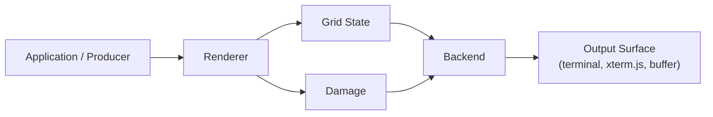
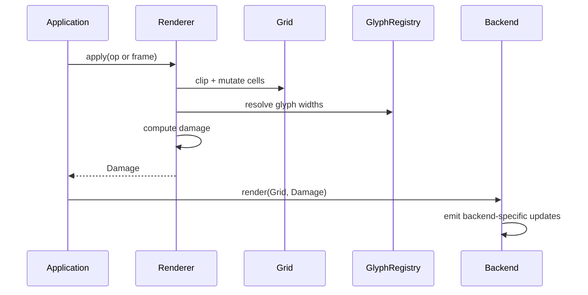

# Architecture

## Core Components

The system has three primary components:

1. **`Grid`** — canonical state representation.
2. **`Renderer`** — mutation layer that applies `RenderOp` / `Frame`.
3. **`GlyphRegistry` / `RenderProfile`** — authoritative glyph-width policy.

The `Grid` is the source of truth. Backends render from `Grid` state (optionally using `Damage` for incremental redraw).

## Grid

A `Grid` is a 2D matrix of `Cell` values:

- `Cell::Empty`
- `Cell::Glyph { .. }` (a visible cell)
- `Cell::Continuation` (a trailing cell of a wide glyph)

The `Grid` stores resolved layout state. It does not perform terminal emulation semantics.

## Renderer

The `Renderer` applies operations sequentially and deterministically:

- `Renderer::apply_op(&mut Grid, &GlyphRegistry, RenderOp)`
- `Renderer::apply(&mut Grid, &GlyphRegistry, &Frame)`
- `Renderer::apply_with_damage(..)` (returns `Damage`)

The renderer is responsible for:

- Bounds clipping
- Wide-glyph expansion into `Continuation` cells
- Maintaining invariants
- Producing damage regions

## Glyph Width Policy

Glyph width is resolved through `GlyphRegistry` / `RenderProfile`.

Width behavior MUST be deterministic for a given registry/profile configuration.

## Damage Model

Mutations produce `Damage` (a bounded set of rectangles, `Rect`), enabling backends to redraw only affected regions.

Damage is derived from actual state changes, not inferred from backend behavior.

## Backend Decoupling

Backends consume:

- Immutable `Grid` reference
- `Damage` (optional)

Backends MUST NOT reinterpret the grid model (e.g., MUST treat `Continuation` as non-rendering).

### High-Level Interaction Flow

### Backend Update Sequence

