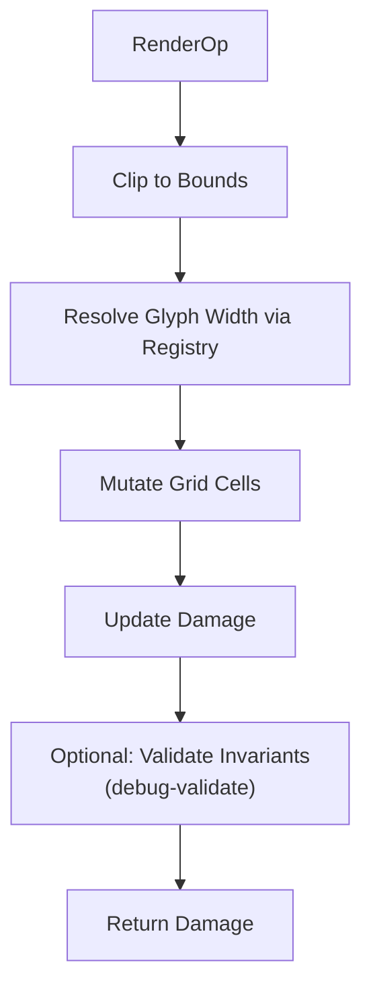
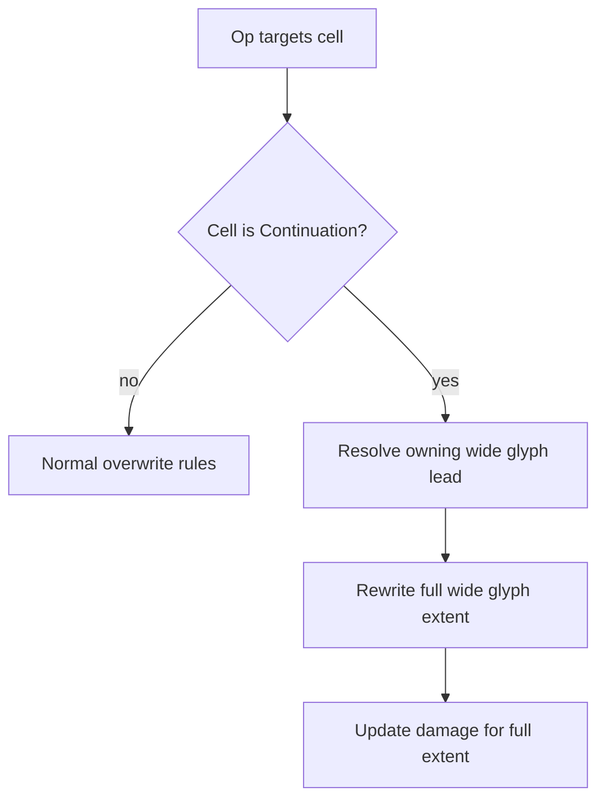

# Rendering Model

This document defines the renderer contract for applying `RenderOp` / `Frame` to a `Grid`.

## Execution Model

1. Operations are applied **sequentially**.
2. Each operation MUST be **deterministic** given the same input `Grid` and `GlyphRegistry`.
3. Each operation MUST maintain `Grid` invariants (see `../invariants.md`).

## Clipping

Operations that reference coordinates outside the grid MUST be clipped to bounds.

No cell outside grid dimensions may be written.

## Wide Glyph Handling

Glyph width is resolved via `GlyphRegistry` / `RenderProfile`.

When applying an operation that writes a glyph of width 2:

- The lead cell MUST store the glyph.
- The trailing cell MUST be written as `Cell::Continuation`.
- Any cells covered by the write MUST be replaced.
- If the write overlaps an existing wide glyph, the renderer MUST rewrite the full overlapped extent to preserve invariants.

## Overwrite Behavior

The renderer MUST treat `Cell::Continuation` as derived state.

If an operation targets a continuation cell, the renderer MUST resolve the owning lead cell and rewrite the owning wide-glyph extent atomically.

## Clear Semantics

Clear operations that produce _visible blank space_ MUST write explicit plain-space cells rather than `Cell::Empty` when required to avoid style bleed in backends that treat spaces as styled glyphs.

(For example: `RenderOp::ClearLine`, `ClearEol`, `ClearBol`, `ClearEos` mirror ANSI EL/ED behavior using plain spaces.)

## Damage

Mutation MUST produce `Damage` that bounds the region(s) of the `Grid` that were modified.

Damage MUST be derived from actual state mutation, not inferred from backend behavior.

### Operation Pipeline

### Continuation Target Handling

