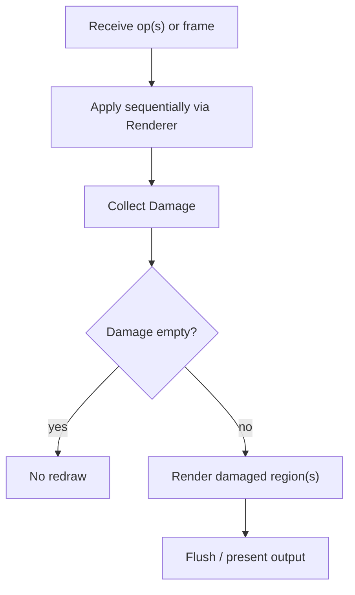

# Backend Integration

This guide describes the required control flow for integrating a backend.

## Reference Loop

## Backend Responsibilities

Backends MUST:

- Use the `Grid` as the source of truth.
- Not reinterpret glyph width policy; the renderer has already expanded wide glyphs.
- Treat `Cell::Continuation` as non-rendering.

Backends SHOULD:

- Coalesce adjacent dirty cells into spans.
- Minimize style transitions by tracking current style state.
