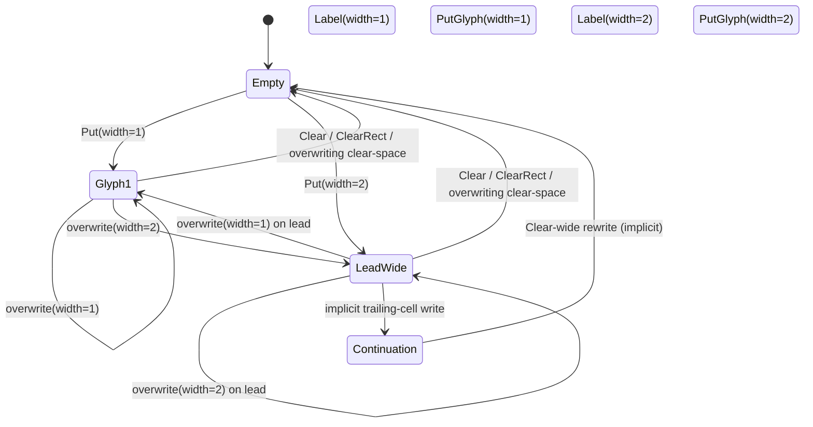

# Invariants

The `Grid` MUST maintain the following invariants.

## Structural

1. A `Cell::Continuation` MUST NOT exist without a corresponding wide-glyph lead cell to its left.
2. A wide glyph MUST occupy contiguous horizontal cells.
3. No two wide glyphs may overlap.
4. `Cell::Continuation` MUST NOT be authored directly by producers; it is derived state created by the renderer.

## Bounds and Clipping

5. No operation may write outside grid dimensions.
6. Operations that extend beyond grid bounds MUST be clipped.

## Determinism

7. Applying the same initial `Grid` and the same operation sequence MUST yield identical final grid state and identical damage output.

## Validation Feature

If the `debug-validate` feature is enabled, the renderer MUST validate invariants after each operation and panic on violation.

## State Transitions

The cell model is intentionally small. Cells transition through a constrained set of states.

### Cell State Machine

### Continuation Target Rule

If an operation targets a `Cell::Continuation`, the renderer MUST resolve the owning wide glyph lead cell and rewrite the entire wide-glyph extent atomically.
