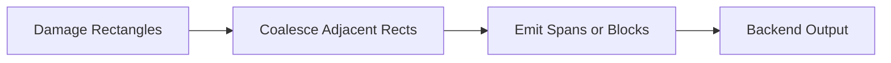

# Performance Characteristics

This document describes expected performance behavior and tradeoffs.

## Complexity Summary

Let:

- `W` = grid width (cells)
- `H` = grid height (cells)
- `N` = number of operations
- `L` = length of text written by an op (in glyphs)
- `A` = area of the damaged region (cells)

### Operation Apply

- Single-cell writes: **O(1)**
- Text draw of length `L`: **O(L)** cell updates, plus width resolution per glyph
- Wide glyph handling: constant-factor overhead; still **O(L)**

### Damage Tracking

Damage is derived from mutations:

- Per op: **O(1)** to extend bounding rectangles / append rects (implementation-dependent)
- Total for `N` ops: **O(N)**

### Backend Rendering

Backend cost depends on strategy:

- Incremental render (using `Damage`): **O(A)**
- Full redraw: **O(W·H)**

## Hot Paths

In steady-state rendering, the hot path is typically:

1. Glyph width resolution (`GlyphRegistry`)
2. Cell writes / clears
3. Damage region updates
4. Backend emission (often dominant)

Backends that emit ANSI control sequences or browser updates frequently dominate runtime; `Damage` exists to minimize that cost.

## Allocation Behavior

The renderer SHOULD avoid allocations in operation application hot paths.

Operations that accept `&str` may incur UTF-8 iteration cost; overall complexity remains linear in glyph count.

## Feature Flag Impact

### `debug-validate`

When enabled, invariant validation runs after each operation. This can materially increase CPU cost. It is intended for development and CI, not for throughput-sensitive production use.

## Backend Strategy Notes

### ANSI Terminal Backends

- Prefer span-based emission (coalesce adjacent cells).
- Track current SGR state and emit deltas.
- Avoid cursor reposition storms.

### xterm.js / Browser Backends

- Prefer batched updates.
- Map `Damage` rectangles to minimal redraw regions.
- Avoid per-cell DOM operations; favor buffer-backed render strategies.

## Damage-to-Backend Mapping

